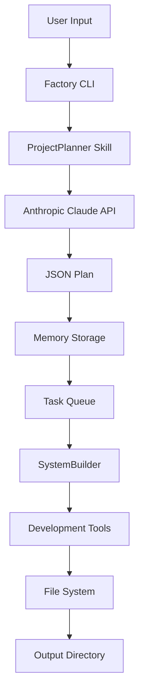

# Agent Factory - Complete Guide

## Table of Contents
1. [Overview](#overview)
2. [How It Works](#how-it-works)
3. [Quick Start](#quick-start)
4. [Using the Factory](#using-the-factory)
5. [Extending the Factory](#extending-the-factory)
6. [Architecture](#architecture)
7. [Troubleshooting](#troubleshooting)

---

## Overview

The Agent Factory is an autonomous system-building framework that transforms natural language ideas into complete software implementations. It combines:

- **ProjectPlanner Skill**: Generates detailed implementation plans (15-30 tasks)
- **Long-term Memory**: Stores project context and decisions
- **Development Tools**: File operations, command execution, directory management
- **Orchestration**: Manages task dependencies and execution flow

### Key Features

✅ **Natural Language Input**: Describe your system in plain English
✅ **Automatic Planning**: AI generates comprehensive task breakdowns
✅ **Memory Integration**: Stores plans and context for future reference
✅ **Extensible**: Add custom skills and tools
✅ **Traceable**: Full execution tracing with SQLite storage

---

## How It Works

### Factory Pipeline

```
User Idea → ProjectPlanner → Implementation Plan → Memory Storage → Task Execution
```

**Step 1: Planning Phase**
- User provides project idea (natural language)
- ProjectPlanner skill analyzes requirements
- Claude Sonnet 4.5 generates structured plan with:
  - Technology stack recommendations
  - High-level architecture
  - 15-30 implementation tasks with dependencies
  - Success criteria
  - Risk assessment

**Step 2: Memory Storage**
- Plan stored in long-term memory (SQLite + ChromaDB)
- Project metadata indexed for retrieval
- Task dependencies mapped

**Step 3: Execution Phase** (Optional)
- SystemBuilder orchestrates task execution
- Development tools available: write_file, create_directory, execute_command
- Progress tracked in real-time
- Results stored in episodic memory

---

## Quick Start

### Prerequisites

```bash
# Python 3.11+
python3 --version

# Virtual environment
cd ~/projects/agent-platform
python3 -m venv venv
source venv/bin/activate  # Mac/Linux

# Install dependencies
pip install -r requirements.txt
```

### Setup

1. **Configure API Keys**

Create `.env` file:
```bash
cd ~/projects/agent-platform
cat > .env << 'EOF'
# Anthropic API (required for planning)
ANTHROPIC_API_KEY=sk-ant-api03-...

# OpenAI API (optional)
OPENAI_API_KEY=sk-...

# Ollama (local models)
OLLAMA_BASE_URL=http://localhost:11434
EOF
```

2. **Initialize Database**

```bash
# Databases created automatically on first run
agent run "test connection"
```

3. **Verify Installation**

```bash
agent --help
```

---

## Using the Factory

### Basic Usage

```bash
agent factory "YOUR_IDEA_HERE" --detail=high
```

### Example: Simple Web App

```bash
agent factory "Build a task management web app with React frontend and FastAPI backend. Users can create, update, delete tasks. Store in PostgreSQL." --detail=medium
```

**Output:**
- Project plan with 15-20 tasks
- Technology stack: React, FastAPI, PostgreSQL, SQLAlchemy
- Implementation roadmap
- Stored in long-term memory

### Example: Complex System

```bash
agent factory "E-commerce platform with:
- Product catalog with search and filters
- Shopping cart and checkout
- Stripe payment integration
- Admin dashboard for inventory management
- Email notifications
- AWS S3 for product images
Tech: Next.js, Node.js, MongoDB, Redis cache" --detail=high
```

**Output:**
- Detailed plan with 25-30 tasks
- Microservices architecture recommendations
- Security considerations
- Scalability patterns

### Planning Without Execution

```bash
agent factory "Your idea here" --no-execute --detail=high
```

Creates plan but doesn't execute. Useful for:
- Reviewing approach before committing
- Cost estimation
- Architecture validation

### Detail Levels

- `--detail=low`: High-level plan (10-15 tasks)
- `--detail=medium`: Standard detail (15-20 tasks) **[DEFAULT]**
- `--detail=high`: Comprehensive plan (20-30 tasks)

---

## Extending the Factory

### Adding Custom Skills

Skills are reusable capabilities that agents can invoke.

**Skill Structure:**
```
skills/
├── builtin/
│   └── your_skill/
│       ├── __init__.py
│       ├── skill.py
│       └── SKILL.md
```

**Example: Custom Skill**

`skills/builtin/code_reviewer/skill.py`:
```python
from skills.base import Skill, SkillMetadata, SkillResult, SkillStatus
from typing import Any

class CodeReviewerSkill(Skill):
    """Reviews code and suggests improvements."""

    def _default_metadata(self) -> SkillMetadata:
        return SkillMetadata(
            name="code_reviewer",
            version="1.0.0",
            description="Analyzes code quality and suggests improvements",
            tags=["code", "quality", "review"],
            inputs={
                "type": "object",
                "properties": {
                    "file_path": {"type": "string"},
                    "focus": {"type": "string", "enum": ["security", "performance", "readability"]}
                },
                "required": ["file_path"]
            },
            outputs={
                "type": "object",
                "properties": {
                    "score": {"type": "number"},
                    "issues": {"type": "array"},
                    "suggestions": {"type": "array"}
                }
            }
        )

    async def execute(self, inputs: dict[str, Any]) -> SkillResult:
        """Execute code review."""
        file_path = inputs["file_path"]
        focus = inputs.get("focus", "readability")

        try:
            # Read file
            with open(file_path, 'r') as f:
                code = f.read()

            # Use LLM to review
            from core.agent import Agent
            from core.models.anthropic_adapter import AnthropicAdapter

            agent = Agent(model_adapter=AnthropicAdapter())

            prompt = f"""Review this code focusing on {focus}:

```
{code}
```

Provide:
1. Quality score (0-100)
2. List of issues found
3. Specific improvement suggestions
"""

            response = await agent.run(prompt)

            # Parse response (simplified)
            return SkillResult(
                status=SkillStatus.SUCCESS,
                output={
                    "review": response,
                    "file": file_path,
                    "focus": focus
                }
            )

        except Exception as e:
            return SkillResult(
                status=SkillStatus.FAILURE,
                error=str(e)
            )
```

`skills/builtin/code_reviewer/__init__.py`:
```python
from skills.builtin.code_reviewer.skill import CodeReviewerSkill

__all__ = ["CodeReviewerSkill"]
```

`skills/builtin/code_reviewer/SKILL.md`:
```markdown
# Code Reviewer Skill

Reviews code and provides quality analysis.

## Inputs
- file_path: Path to code file
- focus: Review focus (security, performance, readability)

## Outputs
- score: Quality score (0-100)
- issues: List of problems found
- suggestions: Improvement recommendations

## Usage
```bash
agent run "Review code in src/main.py focusing on security"
```
```

### Registering Skills

Skills are auto-discovered from `skills/builtin/`. Ensure:
1. `__init__.py` exports skill class
2. Class inherits from `Skill`
3. Implements `execute()` method

### Adding Development Tools

Development tools are functions available to agents during execution.

**Location:** `core/dev_tools.py`

**Example: Add Git Tool**

```python
from core.tool_registry import ToolRegistry

def git_commit(message: str, files: list[str] = None) -> str:
    """
    Create a git commit.

    Args:
        message: Commit message
        files: List of files to commit (default: all changes)

    Returns:
        Commit hash
    """
    import subprocess

    try:
        if files:
            # Stage specific files
            subprocess.run(["git", "add"] + files, check=True)
        else:
            # Stage all changes
            subprocess.run(["git", "add", "."], check=True)

        # Commit
        result = subprocess.run(
            ["git", "commit", "-m", message],
            capture_output=True,
            text=True,
            check=True
        )

        # Get commit hash
        hash_result = subprocess.run(
            ["git", "rev-parse", "HEAD"],
            capture_output=True,
            text=True,
            check=True
        )

        return f"Committed: {hash_result.stdout.strip()}"

    except subprocess.CalledProcessError as e:
        return f"Git error: {e.stderr}"

# Register tool
def register_git_tools():
    registry = ToolRegistry.instance()

    registry.register_function(
        name="git_commit",
        func=git_commit,
        description="Create a git commit with message and optional file list"
    )
```

Then call `register_git_tools()` in `core/dev_tools.py:register_dev_tools()`.

---

## Architecture

### Component Overview

```
agent-platform/
├── core/
│   ├── agent.py              # ReAct agent loop
│   ├── factory.py            # SystemBuilderFactory orchestrator
│   ├── models/               # LLM adapters (Anthropic, Ollama)
│   ├── tool_registry.py      # Tool registration system
│   └── dev_tools.py          # Development utilities
├── skills/
│   ├── base.py               # Skill base classes
│   ├── registry.py           # Skill discovery and loading
│   ├── executor.py           # Skill execution engine
│   └── builtin/
│       └── project_planner/  # Planning skill
├── memory/
│   ├── manager.py            # Memory coordinator
│   ├── long_term.py          # SQLite + ChromaDB storage
│   └── episodic.py           # Task history
├── tracing/
│   ├── tracer.py             # Execution tracing
│   └── models.py             # Span data models
└── workflows/
    └── orchestrator.py       # Multi-step workflows

```

### Data Flow



### Memory Architecture

**Long-term Memory (LTM)**
- SQLite database: `data/long_term_memory.db`
- ChromaDB collections: `data/chromadb/`
- Stores: Facts, project plans, decisions
- Indexed for semantic search

**Episodic Memory**
- SQLite database: `data/episodic_memory.db`
- Stores: Task history, execution logs
- Time-ordered event stream

**Short-term Memory**
- In-process only (conversation buffer)
- Not persisted

### Tracing System

All operations are traced with SQLite storage:
- Span-based model (parent-child relationships)
- Captures: Inputs, outputs, duration, tokens, cost
- Query with SQL or use episodic memory API

**Trace Database:** `data/traces.db`

**Query Example:**
```python
from tracing.tracer import Tracer

tracer = Tracer.instance()

# Get recent LLM calls
import sqlite3
conn = sqlite3.connect("data/traces.db")
cursor = conn.cursor()
cursor.execute("""
    SELECT name, input_tokens, output_tokens, cost_usd
    FROM traces
    WHERE span_type = 'llm_call'
    ORDER BY started_at DESC
    LIMIT 10
""")
for row in cursor.fetchall():
    print(row)
```

---

## Troubleshooting

### Common Issues

**1. "ANTHROPIC_API_KEY not found"**

**Fix:**
```bash
# Check .env file exists
ls ~/projects/agent-platform/.env

# Verify key is set
cat ~/projects/agent-platform/.env | grep ANTHROPIC

# If missing, add it
echo "ANTHROPIC_API_KEY=sk-ant-api03-..." >> .env
```

**2. "Failed to generate valid plan structure"**

**Cause:** JSON parsing failed or incomplete response

**Fix:**
- Check `~/career-automation-project/debug_plan_response.txt` for raw output
- Increase max_tokens in ProjectPlanner skill
- Simplify your idea description

**3. "SpanType.X does not exist"**

**Cause:** Missing enum value in `tracing/models.py`

**Fix:**
```python
# Add to SpanType enum in tracing/models.py
class SpanType(str, Enum):
    # ... existing values ...
    YOUR_NEW_TYPE = "your_new_type"
```

**4. "Planning failed: None"**

**Cause:** Enum comparison error

**Fix:** Use `SkillStatus.SUCCESS` instead of `"success"` when comparing status

**5. Database locked errors**

**Cause:** Concurrent access to SQLite databases

**Fix:**
```bash
# Close all agent processes
killall agent

# Restart
agent run "test"
```

### Debug Mode

Enable verbose logging:

```bash
export LOG_LEVEL=DEBUG
agent factory "your idea" --detail=high
```

View trace details:
```bash
sqlite3 data/traces.db "SELECT * FROM traces ORDER BY started_at DESC LIMIT 5;"
```

### Getting Help

1. Check logs: `data/agent.log`
2. Inspect traces: `data/traces.db`
3. Review memory: `data/long_term_memory.db`
4. GitHub Issues: https://github.com/anthropics/agent-platform/issues

---

## Best Practices

### Writing Effective Factory Prompts

**Good:**
```
Build a blog platform with user authentication, post creation/editing/deletion,
comments, likes, and markdown support. Use React frontend with Next.js,
Node.js + Express backend, MongoDB database, and JWT authentication.
Include admin dashboard for content moderation.
```

**Better:**
```
Blog Platform Requirements:

FEATURES:
- User auth (register, login, profile management)
- Posts (create, edit, delete, markdown editor)
- Comments (nested replies, moderation)
- Social (likes, follows, notifications)
- Admin dashboard (user management, content moderation, analytics)

TECH STACK:
- Frontend: React + Next.js 14 (SSR/SSG)
- Backend: Node.js + Express
- Database: MongoDB + Redis (caching)
- Auth: JWT + refresh tokens
- Storage: AWS S3 (images)
- Search: Elasticsearch (full-text search)

NON-FUNCTIONAL:
- Mobile responsive
- SEO optimized
- Rate limiting
- Input validation
- XSS/CSRF protection
```

### Project Organization

Store project materials in organized structure:
```
~/your-project/
├── inputs/              # Reference materials
│   ├── requirements/    # PRD, specs
│   ├── designs/         # UI mockups
│   └── examples/        # Sample code
├── outputs/             # Factory output
└── docs/                # Generated documentation
```

Reference materials in your prompt:
```bash
agent factory "Build system described in ~/your-project/inputs/requirements/PRD.md"
```

### Cost Management

Factory uses Claude Sonnet 4.5 by default:
- Planning: ~$0.10-0.30 per run
- Execution: Varies by tasks

**Estimate costs:**
- Low detail: ~3K tokens = $0.09
- Medium detail: ~5K tokens = $0.15
- High detail: ~8K tokens = $0.24

**Reduce costs:**
1. Use `--detail=low` for initial exploration
2. Run `--no-execute` to plan without building
3. Review plan before execution
4. Use Ollama (local) for non-critical tasks

### Version Control

Commit factory outputs:
```bash
cd ~/your-project/outputs
git add .
git commit -m "Factory output: [timestamp]"
```

Track iterations:
```bash
# Tag versions
git tag v1-factory-output
git tag v2-after-refinement
```

---

## Next Steps

1. **Implement Career Automation System**: Use factory to build the complete system
2. **Add Custom Skills**: Extend factory with domain-specific capabilities
3. **Integrate CI/CD**: Automate testing and deployment
4. **Monitor Production**: Set up observability and alerts

---

**Last Updated:** 2026-02-02
**Version:** 1.0.0
**Maintainer:** Agent Platform Team
